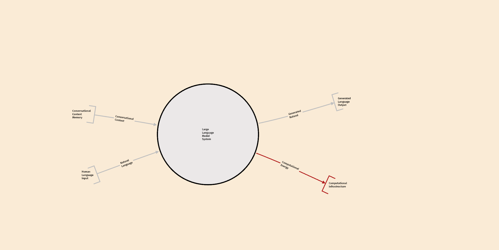

# BERT - Bounded Entity Reasoning Toolkit

[](https://github.com/halcyonic-systems/bert/releases)
[](LICENSE)

A visual toolkit for modeling complex adaptive systems.

[Try it →](https://bert.systems) · [Documentation](https://bert.gitbook.io) · [Download](https://github.com/halcyonic-systems/bert/releases)



## Quick Start

**Web**: [bert.systems](https://bert.systems)

**Desktop**: Download from [Releases](https://github.com/halcyonic-systems/bert/releases) (macOS, Windows, Linux)

**Build from source**:
```bash
git clone https://github.com/halcyonic-systems/bert.git && cd bert
npm install && cargo tauri dev
```

## What You Can Do

- Map flows of energy, information, and matter between components
- Visualize hierarchical system structure
- Analyze system boundaries and interfaces

## Documentation

[User Guide](https://bert.gitbook.io) · [Contributing](CONTRIBUTING.md) · [Developer Docs](docs/)

## License

MIT
