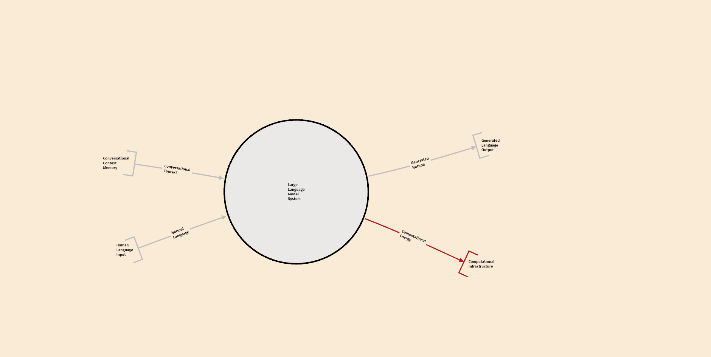

# BERT - Bounded Entity Reasoning Toolkit

[](https://github.com/halcyonic-systems/bert/releases)
[](LICENSE)

A visual toolkit for modeling systems as flows of energy, material, and information across boundaries. Built on the systems science framework of [George Mobus](https://faculty.washington.edu/gmobus/).

[Try it](https://bert.systems) · [Docs](docs/README.md) · [Download](https://github.com/halcyonic-systems/bert/releases)



## Get Started

**Web**: Open [bert.systems](https://bert.systems) in any modern browser.

**Desktop**: Grab the latest build from [Releases](https://github.com/halcyonic-systems/bert/releases) (macOS, Windows, Linux).

**From source**:
```bash
git clone https://github.com/halcyonic-systems/bert.git && cd bert
npm install && cargo tauri dev
```

## What BERT Does

**Model** systems visually. Drag subsystems and interfaces from the palette, connect them with typed flows, and navigate the hierarchy by double-clicking into any subsystem.

**Generate** models from natural language. Describe a system in plain English and BERT compiles it into a validated model through a deterministic pipeline. Also available as a CLI:
```bash
cargo run -p bert-tauri --bin bert-generate < spec.json > model.json
```

**Validate** models at load time. Four validation layers check structural integrity, reference consistency, required fields, and processor boundary tracing. Warnings let you continue; errors block loading with clear suggestions.

**Query** models as typed graphs. The TypeDB transpiler projects any BERT model into a queryable database for cross-model structural comparison.

**Simulate** system dynamics. The Mesa bridge converts BERT models into Python agent-based simulations (active development).

## Key Concepts

BERT models are structured around the Mobus 8-tuple: a system is defined by its components, boundary, interfaces, flows, sources, sinks, internal processes, and history. Every model is a JSON file that conforms to the [System Language spec](docs/system-language-spec.md).

For the formal schema, see the [Schema Reference](docs/bert-schema-reference.md).

## Architecture

| Layer | Stack |
|-------|-------|
| Rendering | [Bevy](https://bevyengine.org/) (ECS) |
| UI | [Leptos](https://leptos.dev/) (reactive Rust) |
| Desktop | [Tauri](https://tauri.app/) |
| Web | WASM (same codebase) |
| Persistence | JSON files, [TypeDB](https://typedb.com/) projection |
| Generation | Rust deterministic compiler, Ollama extraction |

## Documentation

| Resource | What it covers |
|----------|---------------|
| [Getting Started](docs/getting-started.md) | Install, first model, controls |
| [Schema Reference](docs/bert-schema-reference.md) | JSON format, validation layers, ID conventions |
| [System Language Spec](docs/system-language-spec.md) | Formal system modeling language |
| [TypeDB Schema](docs/bert-typedb-schema.md) | Graph projection and query patterns |
| [Build Guide](docs/BUILD.md) | Development setup, WASM builds |
| [Contributing](CONTRIBUTING.md) | How to contribute |

## License

MIT
