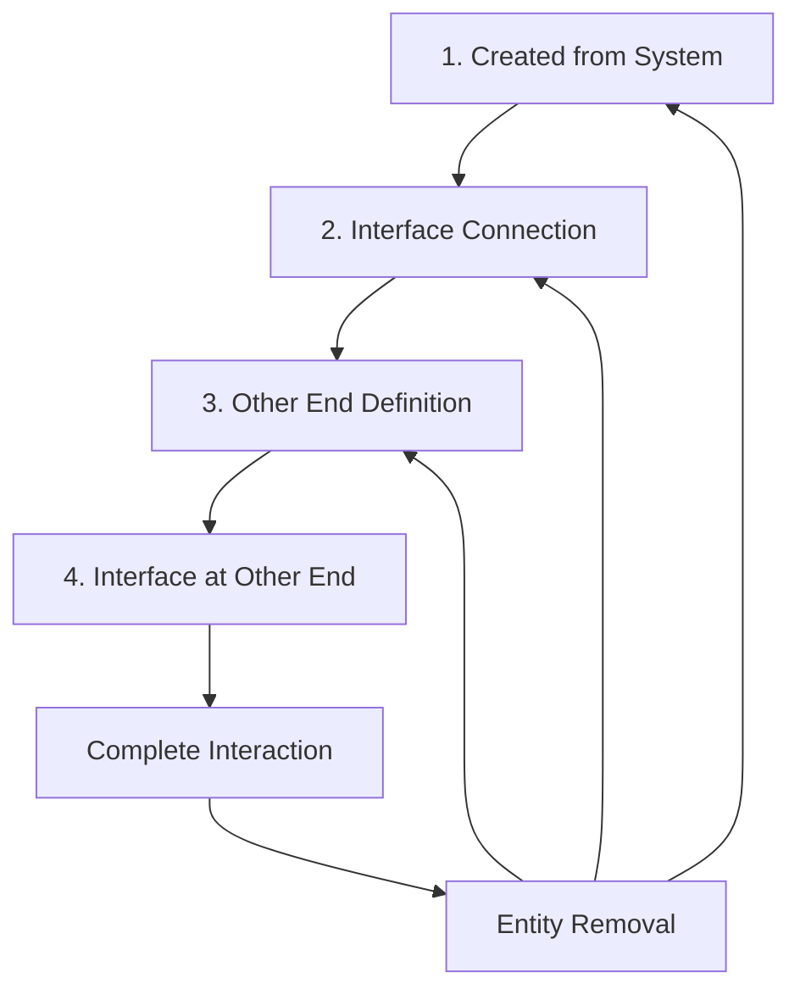

# Interaction System Architecture

## Overview

The interaction system in BERT implements a sophisticated component-based architecture for managing flows (connections) between system entities. This document provides comprehensive coverage of the interaction lifecycle, component relationships, and implementation patterns based on the original system design.

**Key Concepts:**
- **Interactions** (also called "flows" in code) represent connections between system entities
- **Component-based lifecycle** with dynamic component addition/removal
- **Four-stage creation process** with UI state management
- **Automatic curve generation** for visual representation

## Table of Contents

- [Interaction Lifecycle](#interaction-lifecycle)
- [Component Architecture](#component-architecture)
- [Lifecycle Implementation](#lifecycle-implementation)
- [Entity Removal and State Management](#entity-removal-and-state-management)
- [Permanent Components](#permanent-components)
- [Integration with Current Codebase](#integration-with-current-codebase)
- [Development Guidelines](#development-guidelines)

## Interaction Lifecycle

The interaction system follows a **four-stage lifecycle** that manages the progressive connection of system entities through a component-based state machine.

### Lifecycle Stages



#### Stage 1: Created from System
**State**: Interaction spawned from a system entity
**Components**: 
- `FlowStartConnection` (outflow) or `FlowEndConnection` (inflow)
- `HasFlowInterfaceButton` with button entity reference

**Behavior**: 
- Interaction is connected to originating system
- Interface creation button is available
- User can create interface to proceed to Stage 2

#### Stage 2: Interface Connection  
**State**: Interface created at originating system
**Components**:
- `FlowStartConnection` or `FlowEndConnection` (retained)
- `FlowStartInterfaceConnection` or `FlowEndInterfaceConnection` (added)
- `HasFlowOtherEndButton` (added, no entity reference)

**Behavior**:
- Interface button removed, interface entity created
- Other end button (source/sink) becomes available
- User can define target to proceed to Stage 3

#### Stage 3: Other End Definition
**State**: Target end defined (source/sink or system)
**Components**:
- Connection components from Stage 2 (retained)
- `FlowEndConnection` or `FlowStartConnection` (added for target)

**Behavior**:
- **Root system context**: Source/sink immediately created and connected
- **Subsystem context**: Target selection with mouse interaction
- **System-to-system**: Additional interface button may appear (Stage 4)

#### Stage 4: Interface at Other End (System Connections Only)
**State**: Interface created at target system  
**Components**:
- All components from Stage 3 (retained)
- `FlowStartInterfaceConnection` or `FlowEndInterfaceConnection` (added for target)

**Behavior**:
- Complete system-to-system connection with interfaces at both ends
- Full interaction lifecycle completed

## Component Architecture

### Connection Components

The interaction system uses specialized components to track entity relationships:

#### Primary Connection Components
```rust
// Core connection tracking
FlowStartConnection    // Connects interaction to source system
FlowEndConnection      // Connects interaction to target system/entity

// Interface connection tracking  
FlowStartInterfaceConnection  // Connects interaction to source interface
FlowEndInterfaceConnection    // Connects interaction to target interface
```

#### UI State Components
```rust
// Button state management
HasFlowInterfaceButton {
    button_entity: Entity  // Reference to interface creation button
}

HasFlowOtherEndButton      // Marker for other end button availability
                          // (no entity reference - button managed separately)
```

### Component Relationships

The component architecture uses a **target field pattern** where components reference related entities:

```rust
// Example component structure
struct FlowStartConnection {
    target: Entity,  // References the connected system entity
}

struct HasFlowInterfaceButton {
    button_entity: Entity,  // References the UI button entity
}
```

**Visual Representation in Documentation:**
- Components shown as: `Component`
- Target relationships shown as: `Component` → `Entity` (purple dashed arrows)
- Button relationships explicitly labeled with `.button_entity`

## Lifecycle Implementation

### Stage Transitions

#### 1. Created → Interface
**Trigger**: Interface creation button pressed
**Process**:
1. Remove `HasFlowInterfaceButton` component and button entity
2. Create interface entity at system boundary
3. Add `FlowStartInterfaceConnection` or `FlowEndInterfaceConnection`
4. Add `HasFlowOtherEndButton` marker
5. Create and display other end button (source/sink)

#### 2. Interface → Other End  
**Trigger**: Source/sink button pressed
**Process**:
- **Root System Context**:
  1. Immediately create source/sink entity
  2. Add `FlowEndConnection` or `FlowStartConnection`
  3. Complete interaction (no Stage 4)

- **Subsystem Context**:
  1. Attach interaction end to mouse cursor
  2. **Free space click**: Create source/sink (same as root system)
  3. **System click**: Connect to target system, proceed to Stage 4

#### 3. Other End → Interface at Other End
**Trigger**: Interface creation button at target system
**Process**:
1. Remove interface button and `HasFlowInterfaceButton`
2. Create interface entity at target system boundary  
3. Add `FlowEndInterfaceConnection` or `FlowStartInterfaceConnection`
4. Complete system-to-system connection

### Context-Dependent Behavior

#### Root System vs. Subsystem Context
The interaction behavior varies based on the originating system's context:

**Root System**:
- Direct source/sink creation
- No mouse cursor attachment
- Simplified workflow (3 stages maximum)

**Subsystem**:
- Mouse cursor interaction for target selection
- Support for system-to-system connections
- Full 4-stage workflow available

#### Focus-Dependent UI
Interface creation buttons are only displayed when the target system has focus:
- `HasFlowInterfaceButton` component added on system focus
- Button entity created and positioned
- Component and button removed when focus lost

## Entity Removal and State Management

### Removal Impact on Interactions

When connected entities are removed, interactions automatically revert to appropriate lifecycle stages:

#### Interface Removal
**Impact**: Interaction reverts to previous stage
**Example**: Complete interaction (Stage 4) → Interface removed → Stage 2 or Stage 3

#### Source/Sink Removal  
**Impact**: Interaction reverts to Stage 2 (Interface)
**Process**:
1. Remove `FlowEndConnection` or `FlowStartConnection`
2. Add `HasFlowOtherEndButton` marker
3. Create new other end button
4. Restore Stage 2 state

#### System Removal
**Impact**: Complete interaction removal or partial reversion
**Process**: Depends on which system is removed and interaction stage

### Special Lifecycle State

**Stage 2.5: Connected to Entity, Missing Start Interface**
This state can occur through interface removal:
- **Components**: `FlowStartConnection`, `FlowEndConnection`, `HasFlowInterfaceButton`
- **Visual**: Interaction connected to sink but missing start interface
- **Recovery**: Interface button available to complete connection

## Permanent Components

Every interaction entity contains two permanent components regardless of lifecycle stage:

### Flow Component
```rust
struct Flow {
    flow_type: FlowType,        // Energy, Material, Message
    usability: Usability,       // Directional properties
    amount: Option<f32>,        // Quantity (if applicable)
    // Additional flow attributes
}
```

**Purpose**: Defines the semantic properties of the interaction
**Lifecycle**: Added at spawn, never removed

### FlowCurve Component  
```rust
struct FlowCurve {
    start_point: Vec3,          // Curve start position
    end_point: Vec3,            // Curve end position  
    start_direction: Vec3,      // Start tangent (unit vector)
    end_direction: Vec3,        // End tangent (unit vector)
}
```

**Purpose**: Defines the visual curve representation
**Lifecycle**: Added at spawn, updated throughout lifecycle
**Integration**: See [Visual System Architecture](visual-system-architecture.md) for curve computation details

## Integration with Current Codebase

### File Locations

Based on the current codebase structure:

```
src/bevy_app/
├── components/
│   ├── connections.rs          # Flow and connection components
│   └── system_elements.rs      # System entity components
├── systems/
│   ├── ui/                     # Interaction UI systems
│   └── subsystem.rs           # Subsystem interaction logic
├── bundles/spawn/              # Entity creation bundles
└── events.rs                   # Interaction events
```

### Component Definitions

**Current Implementation Status**:
- ✅ `Flow` and `FlowCurve` components implemented
- ✅ Connection components (`FlowStartConnection`, etc.) implemented  
- ✅ UI state components (`HasFlowInterfaceButton`, etc.) implemented
- ✅ Lifecycle management systems implemented

### Event Integration

The interaction system integrates with BERT's event system:
- **Creation Events**: Triggered by UI interactions
- **State Change Events**: Lifecycle stage transitions
- **Removal Events**: Entity cleanup and state reversion

## Development Guidelines

### Adding New Interaction Types

To extend the interaction system:

1. **Define Flow Type**: Add to `FlowType` enum in `Flow` component
2. **Visual Representation**: Update curve rendering in visual systems
3. **UI Integration**: Add creation buttons and property editing
4. **Lifecycle Integration**: Ensure proper component management

### Component Management Best Practices

1. **Lifecycle Awareness**: Always consider current stage when adding/removing components
2. **Target References**: Maintain proper entity references in component target fields
3. **UI State Consistency**: Keep button components synchronized with UI state
4. **Cleanup Responsibility**: Ensure proper component removal during state transitions

### Testing Interaction Lifecycle

**Critical Test Scenarios**:
1. **Complete Lifecycle**: Test all four stages in sequence
2. **Entity Removal**: Verify proper state reversion for each removal type
3. **Context Switching**: Test root system vs. subsystem behavior differences
4. **Focus Management**: Verify button appearance/disappearance with system focus

### Performance Considerations

1. **Component Queries**: Optimize systems for specific lifecycle stage queries
2. **Button Management**: Efficient creation/removal of UI button entities
3. **Curve Updates**: Minimize `FlowCurve` recalculation frequency
4. **State Transitions**: Batch component additions/removals when possible

---

## Related Documentation

- [Visual System Architecture](visual-system-architecture.md) - Curve computation and rendering
- [Component Relationship Guide](component-relationship-guide.md) - Cross-system component patterns
- [Entity Lifecycle Management](entity-lifecycle-management.md) - General entity management patterns
- [Contributing Guidelines](../contributing/contributing.md) - Development standards and practices

---

**Note**: This document is based on the original system architecture specifications and has been updated to reflect current codebase implementation. For implementation details and code examples, refer to the source files listed in the Integration section. 