# Get Started with BERT

**BERT** (Bounded Entity Reasoning Toolkit) is a visual software tool that guides analysts through the rigorous decomposition and analysis of complex adaptive systems.

## Getting Started 

The fastest way to start using BERT is through our web application: 🌐 [bert.systems](https://bert.systems/)​

For desktop applications with offline capabilities, download the version for your operating system:

* ​[MacOS Apple Silicon](https://github.com/halcyonic-systems/bert/releases/download/v0.1.0-beta/bert_0.1.0_aarch64.dmg)​
* ​[MacOS Intel](https://github.com/halcyonic-systems/bert/releases/download/v0.1.0-beta/bert_0.1.0_x64.dmg)​
* ​[Windows](https://github.com/halcyonic-systems/bert/releases/download/v0.1.0-beta/bert.exe)​

## How BERT Works

BERT combines rigorous systems science with modern software architecture:

```mermaid
graph LR
    A["📊 Systems Science<br/>Theory & Method"] --> B["🎨 Interactive Interface<br/>Real-time Modeling"]
    B --> C["🔍 Deep Analysis<br/>System Understanding"]
    
    style A fill:#e1f5fe
    style B fill:#e8f5e8
    style C fill:#fff3e0
```

**Web & Desktop:** BERT runs identically in your browser or as a desktop app, with full feature parity across platforms.

## Learning Path 

If you're new to BERT, we recommend following this learning path:

1. Start with the [Creating Your First System](getting-started/creating-your-first-system/) tutorial
2. Learn about the [Core System Elements](getting-started/creating-your-first-system/system-elements.md)
3. Learn the Essential [Controls and Interface](getting-started/controls-and-interface.md)
4. Explore [System Decomposition](getting-started/creating-your-first-system/step-11-system-decomposition.md)
5. Practice with our [Example Analyses](getting-started/examples/)

