# Architecture

BERT implements a Layer 4 System Language architecture built with modern web technologies.

```mermaid
graph LR
    A["📊 Systems Science<br/>Theory & Method"] --> B["🎨 Interactive Interface<br/>Real-time Modeling"]
    B --> C["🔍 Deep Analysis<br/>System Understanding"]
    
    style A fill:#e1f5fe
    style B fill:#e8f5e8
    style C fill:#fff3e0
```

## Technical Stack

- **Frontend**: Leptos (Rust-based reactive web framework)
- **Visualization**: Bevy (game engine for real-time rendering)
- **Desktop**: Tauri (cross-platform desktop applications)
- **Crate Name**: `bert` (main workspace), `bert-tauri` (desktop backend)

## Core Architecture

**Layer 4 System Language:**
1. **Layer 1**: Bevy ECS (Entity-Component-System foundation)
2. **Layer 2**: System Elements (core components representing system entities)
3. **Layer 3**: Knowledge Representation (data model and serialization)
4. **Layer 4**: System Orchestration (event-driven coordination and UI)

## Key Components

- **System Elements**: `/src/bevy_app/components/system_elements.rs`
- **Data Model**: `/src/bevy_app/data_model/` (WorldModel and serialization)
- **UI Integration**: `/src/leptos_app/` (reactive user interface)
- **Visual Bundles**: `/src/bevy_app/bundles/spawn/` (entity creation patterns)

## Detailed Architecture Documentation

**Comprehensive technical details:**
- [Architecture Overview](architecture/comprehensive-architecture-overview.md) - Complete technical architecture and design principles
- [Visual System Architecture](architecture/visual-system-architecture.md) - Rendering pipeline and interaction systems  
- [Interaction System Architecture](architecture/interaction-system-architecture.md) - User interaction lifecycle and event handling

**Architecture Decision Records:**
- [ADR-001: Signal Pattern Decision](architecture/decisions/adr-001-signal-pattern.md) - Memo::new vs Signal::derive for reactive components

**Design Source Files:**
Architecture diagrams and design assets are maintained in `/docs/architecture/` as Affinity Publisher source files (.afpub) and PDFs for collaborative editing.