# Visual Architecture Guide

This guide provides clear, visual explanations of BERT's architecture using simple diagrams. Whether you're a developer getting started or trying to understand how the pieces fit together, these diagrams will help you quickly grasp the system design.

## 🏗️ High-Level Architecture Overview

BERT's architecture consists of five main layers that work together to provide real-time system modeling:

```mermaid
graph TB
    subgraph "BERT Architecture Overview"
        subgraph "Frontend Layer"
            A["Leptos UI<br/>Reactive Web Components<br/>🎨 User Interface"]
        end
        
        subgraph "Core Engine" 
            B["Bevy ECS<br/>Entity-Component-System<br/>⚡ Real-time Rendering"]
        end
        
        subgraph "Platform Layer"
            C["Tauri Framework<br/>Cross-platform Runtime<br/>💻 Desktop Integration"]
        end
        
        subgraph "Data & Logic"
            D["System Elements<br/>Components & Entities<br/>🔧 Business Logic"]
            E["JSON Persistence<br/>File System Access<br/>💾 Data Storage"]
        end
    end
    
    A <--> B
    B <--> D
    B <--> E
    C --> A
    C --> E
    
    style A fill:#e3f2fd
    style B fill:#e8f5e8
    style C fill:#fff3e0
    style D fill:#f3e5f5
    style E fill:#fce4ec
```

**What this shows:** The five main components of BERT and how they interact. The Bevy ECS engine sits at the center, coordinating between the user interface, data storage, and business logic.

**Key insight:** Unlike traditional web applications, BERT uses a game engine (Bevy) for real-time rendering and interaction management.

## 🔄 Data Flow Architecture

This diagram shows how information flows through BERT from user input to visual output:

**What this shows:** How user interactions flow through the system to create and modify system models in real-time.

**Key insight:** The event system acts as a bridge between the UI and the core engine, enabling reactive updates across the entire application.

## 🌐 Hybrid Deployment Architecture

BERT runs identically in web browsers and as a desktop application:

**What this shows:** How BERT maintains feature parity between web and desktop environments using a single codebase.

**Key insight:** The same core application runs in both contexts, with platform-specific adapters handling differences in file access and native integration.

## 🔗 Component Interaction Lifecycle

This diagram illustrates how flows (connections) are created between system elements:

**What this shows:** The four-stage process for creating connections between system elements, and how the system handles entity removal.

**Key insight:** BERT uses a component-based state machine to manage complex interaction workflows, automatically recovering from entity deletions.

## 🧬 System Language Implementation

This shows how BERT implements systems science theory through modern technology:

**What this shows:** How theoretical systems science concepts are translated into practical software components.

**Key insight:** BERT bridges the gap between abstract theory and concrete implementation, making systems science accessible through visual, interactive tools.

## 🎯 Quick Reference

**For New Users:** Start with the [High-Level Architecture](#high-level-architecture-overview) to understand the main components.

**For Developers:** Focus on the [Data Flow](#data-flow-architecture) and [Component Interaction](#component-interaction-lifecycle) diagrams to understand how the system works internally.

**For Researchers:** The [System Language Implementation](#system-language-implementation) diagram shows how BERT translates theory into practice.

**For Platform Questions:** The [Hybrid Deployment](#hybrid-deployment-architecture) diagram explains web vs. desktop differences.

---

💡 **Next Steps:** Ready to dive deeper? Check out the [detailed architecture documentation](architecture.md) or explore the [component definitions in the codebase](https://github.com/your-repo/tree/main/src/bevy_app/components). 