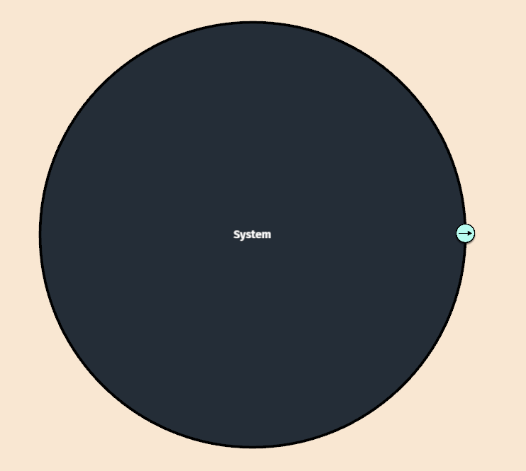

# Step 1: Starting a New Project

When you first open BERT, you'll be presented with a blank canvas containing a main system circle.

1. This circle represents your system of interest - no explicit "new project" step is needed
2. You can begin working immediately with this blank system
3. If you want to open an existing project instead, press `Ctrl+L`

<figure><figcaption></figcaption></figure>
