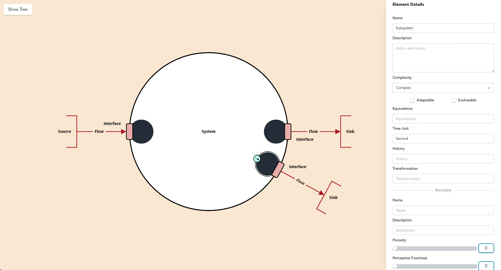
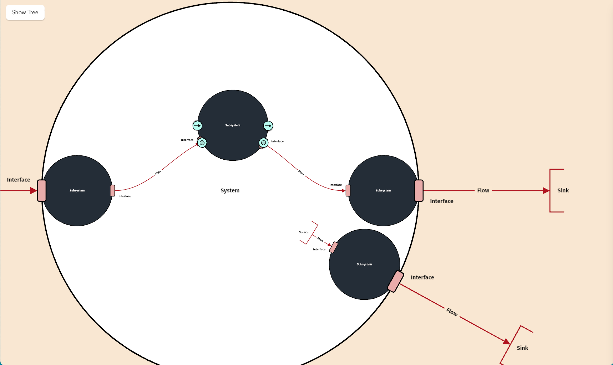

# Step 10: Adding Internal Flows

**Click the input subsystem to add an output flow with the green arrow**

<figure><figcaption></figcaption></figure>

**Click the output subsystem to add an input flow with the green arrow**

**Click the waste output subsystem to add an input flow with the green arrow.**&#x20;

**Add interfaces, sources and sinks.**&#x20;

**Hold shift and left click on the input sink and the output source. Click the green circle icon to create a new internal subsystem that is not directly associated with an SOI interface.**

<figure><figcaption></figcaption></figure>

<figure><figcaption></figcaption></figure>
