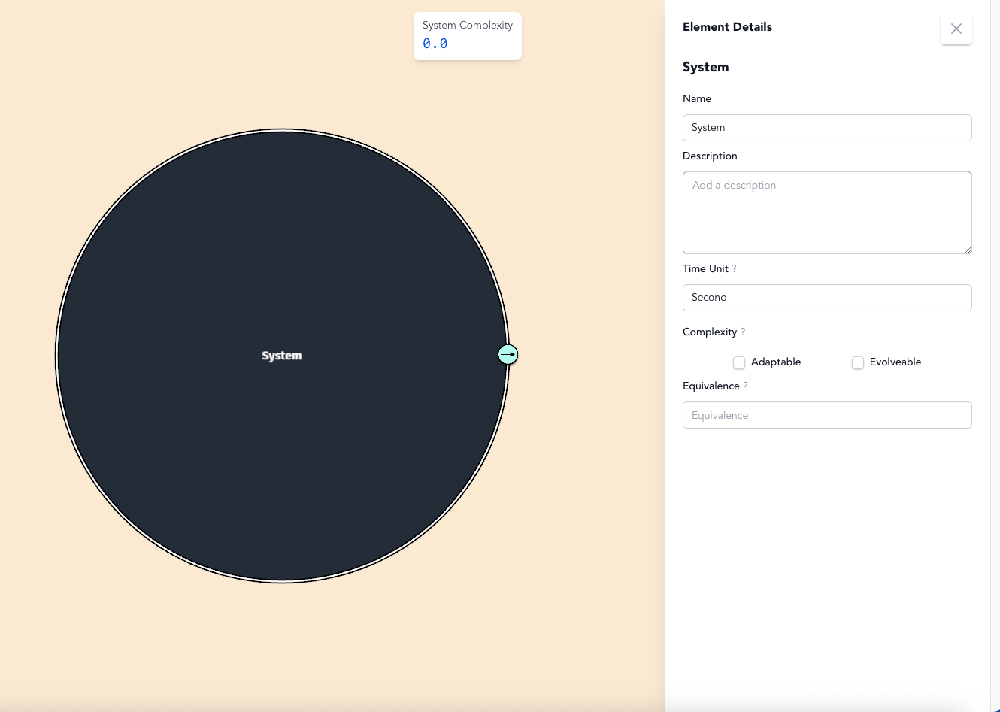

# Step 2: Define Your System of Interest

## Choose a System Worth Understanding

BERT is most useful when you have a real-world system that is complex, that you're deeply interested in, and that you either want to deepen your understanding of how it works, or share your understanding with others.

Think about a system that matters to you. Examples from our model library include:
- **Biological systems**: How does a cell maintain life? How do ecosystems balance energy flows?
- **Technological systems**: How does a solar panel convert light to electricity? How does an LLM generate text?
- **Social systems**: How does an organization coordinate work? How do markets set prices?
- **Meta-systems**: How does BERT itself work as a modeling platform?

Choose something you work with, want to improve, need to explain to others, or are curious about.

## Name and Define Your System

Click on the main system circle. This opens the details panel where you'll define what you're analyzing.

<figure><figcaption></figcaption></figure>

**Give your system a clear name and purpose.** This is essential for grounding a good analysis. Be specific about:
- What you call this system
- What its primary purpose is
- Why this particular system matters to analyze

<figure><figcaption>
The simplified details panel in v0.2.0
</figcaption></figure>

### Quick Guide to Optional Fields

**Time Unit**: The temporal resolution for your analysis (seconds, days, years). Choose what makes sense for your system's dynamics.

**Complexity**: System behavior type - Simple (predictable), Adaptive (responds to environment), or Evolveable (can fundamentally change structure).

**Equivalence**: Component type classification - what kind of thing this is based on its essential function (e.g., "Ribosome" in a cell, "Sales Team" in a company).

Clearly defining what your system is and what it does shapes everything that follows. A vague system definition leads to a vague analysis. A precise definition enables deep understanding.

Press `Ctrl+S` periodically to save your work.
