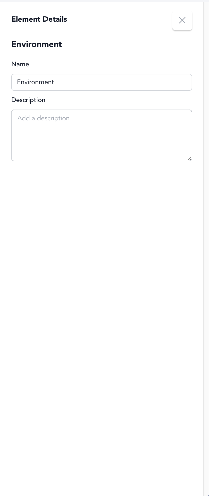
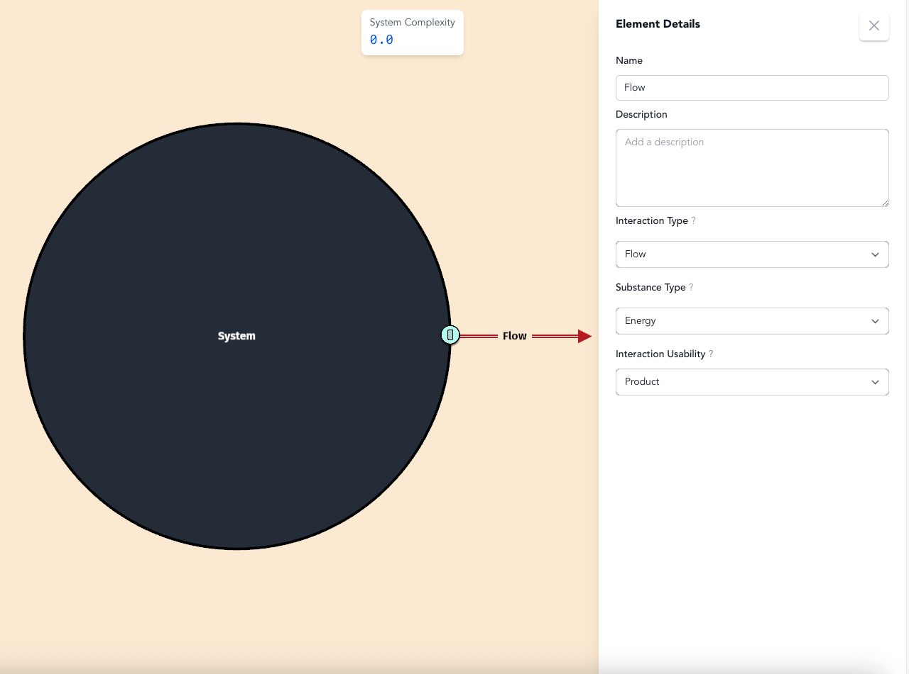

# Step 3: Identify Primary Output

## What Does Your System Produce?

Every system exists for a reason - it produces something that its environment needs or values. Examples from our model library:
- **Cell**: Oxygen and waste products
- **Ecosystem**: Biomass and habitat services
- **Solar Panel**: Electrical energy
- **Organization**: Products, services, or coordination
- **LLM**: Generated text responses

Ask yourself: **What is the main thing your system creates or provides?**

## Understanding Environment and Boundary

To identify outputs, you need to understand where they go and how they get there:

**The Environment** is everything outside your system - the context in which your system exists. It contains the customers, users, or other systems that need what your system produces. Click in the space outside your system circle to access the environment panel and describe this context.

<figure><figcaption>
Environment details panel in v0.2.0
</figcaption></figure>

**The Boundary** is the edge between your system and its environment - like a cell membrane or a company's market interface. Outputs must cross this boundary to reach their destination. Click on the gray ring around your system to access the boundary panel and define how permeable or selective this edge is.

<figure><figcaption>
Boundary details panel in v0.2.0
</figcaption></figure>

Understanding who needs your system's outputs (environment) and how those outputs leave your system (boundary) clarifies what your primary output actually is and why it matters.

## Creating Your First Output Flow

Once you know what your system produces and where it goes:

1. **Click the green flow button** in the toolbar
2. **Draw an arrow** from your system circle outward (this will connect to an interface in the next step)
3. **Click on the flow** to define what it is

<figure><figcaption></figcaption></figure>

## Defining Your Output

When you click on the flow, specify:

**Substance Type** - What kind of output is this?
- **Material**: Physical products or substances
- **Energy**: Power, heat, work
- **Information**: Data, signals, messages

**Usability** - For outputs, this is typically "Product" (something useful your system creates)

Start with your system's most important output. You can add secondary outputs later as your analysis deepens.
