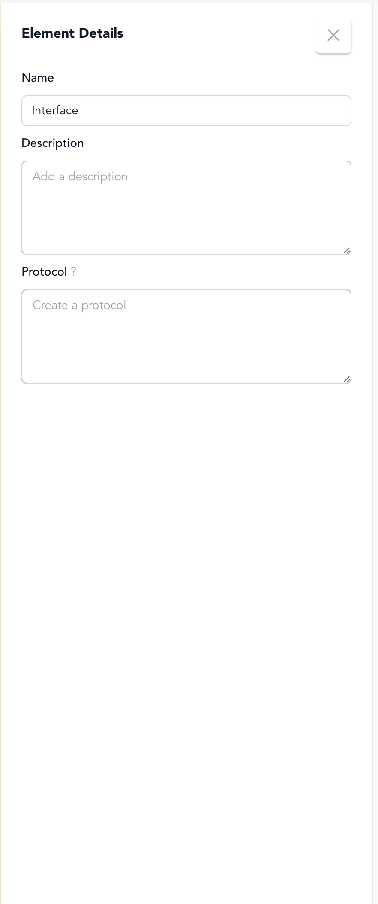

# Step 4: Define Output Interface

## How Does Your System Deliver Its Output?

You've identified what your system produces and where it goes. Now you need to understand HOW it gets there - through what mechanism, process, or channel does your output actually leave your system?

This delivery mechanism is called an **interface** - the specific way your system connects with its environment to transfer outputs.

## Creating the Interface

When you created your output flow in Step 3, you may have noticed it ends with a small rectangle at the system boundary. This rectangle becomes your interface.

**Click on this rectangle to define your output interface:**

<figure><figcaption></figcaption></figure>

## Defining Your Interface

Click on the interface element to specify how your system delivers its output:

**Name** - What do you call this delivery mechanism? Examples from our model library:
- **Cell**: "Cell Membrane Transport Proteins"
- **Ecosystem**: "Predation Interface"  
- **Solar Panel**: "Electrical Output Terminals"
- **Organization**: "Sales Interface" or "Service Delivery"
- **LLM**: "Response Generation API"

**Description** - How does this interface actually work? What makes it effective at delivering your system's output to its environment?

**Protocol** - What rules or algorithm does this interface use to decide what goes out (and potentially what comes in)? This is the decision-making logic that governs the interface's behavior.

<figure><figcaption>
Interface details panel in v0.2.0
</figcaption></figure>

## Understanding Interface Protocols

Think of a protocol as the "brain" of your interface - the set of rules that determine:
- When to allow output to flow
- What quality or quantity standards to maintain  
- How to handle different types of requests from the environment
- What feedback to send back to the system

**Examples:**
- **Sales Counter**: "Process orders during business hours, verify payment before releasing products"
- **Cell Membrane**: "Allow glucose in when internal levels are low, expel waste when concentration exceeds threshold" 
- **Website API**: "Authenticate users, rate-limit requests, return error codes for invalid queries"

Interfaces are where your system meets the world. They're not abstract - they're the actual mechanisms, channels, or processes that make your outputs available to those who need them.
