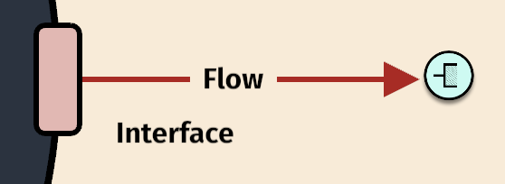
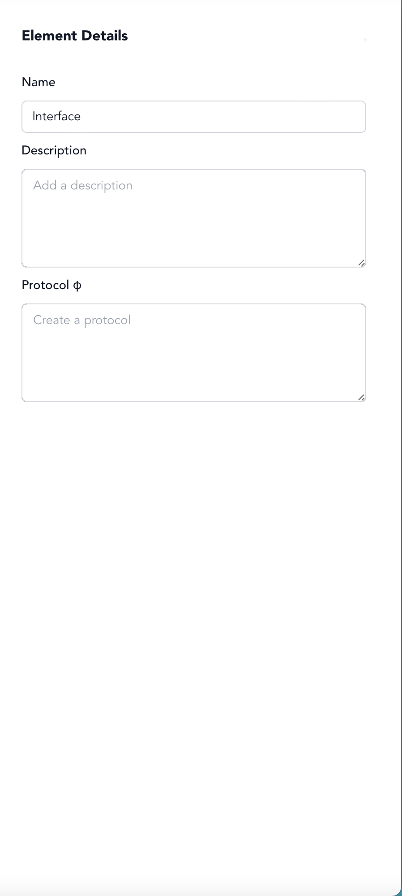

# Step 4: Define Output Interface

### Interfaces

**Interfaces** are one of the most important yet often overlooked aspects of systems.&#x20;

They are a specialized type of **subsystem** that is responsible for handling interactions between a **system** and its **environment**. They are the points where a system manages its interactions with other systems.&#x20;

Immediately after clicking the green button to create a **flow**, you may have noticed it transform into a rectangle.&#x20;

**Click on this rectangle to create an interface**

<figure><figcaption></figcaption></figure>

**Click on the newly created red interface to open up an element details page.**&#x20;

<figure><figcaption></figcaption></figure>

> 💡 **Tip**: Think about.....when designating your interfaces

<figure><figcaption></figcaption></figure>
