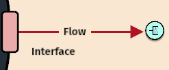

# Step 5: Add Customer Sink

## Who Receives Your System's Output?

You've defined what your system produces and how it delivers that output through its interface. Now you need to identify WHO actually receives and uses that output.

This receiver is called a **sink** - the entity in your system's environment that needs and values what your system provides.

## Creating the Output Sink

Your output flow needs somewhere to go after it leaves your interface:

1. **Click the green sink button** in the toolbar
2. **Place the sink** in the environment outside your system
3. **Connect the flow** from your interface to this new sink

<figure><figcaption></figcaption></figure>

## Defining Your Output Receiver

Click on the sink entity to specify who or what receives your system's output:

**Name** - Who or what receives this output? Examples from our model library:
- **Cell**: "Bloodstream" (receives oxygen)
- **Ecosystem**: "Herbivore Population" (receives plant biomass)  
- **Solar Panel**: "Electrical Grid" (receives clean energy)
- **Organization**: "Market" (receives products/services)
- **LLM**: "End User" (receives generated text)

**Description** - What do they need your output for? How do they use it? Why does it matter to them?

<figure><figcaption></figcaption></figure>

<figure><figcaption></figcaption></figure>

## Why This Matters

Understanding your output receiver helps clarify:
- **Purpose**: Why does your system exist? What need does it serve?
- **Quality**: What standards must your output meet to be useful?
- **Success**: How do you know if your system is working well?

> 🔑 **Key insight**: Every system exists to serve some recipient or beneficiary in its environment. If you can't identify who or what benefits from your system's output, you may need to reconsider what your system's true purpose is.

