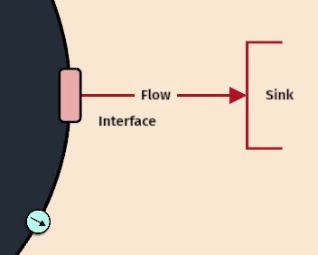
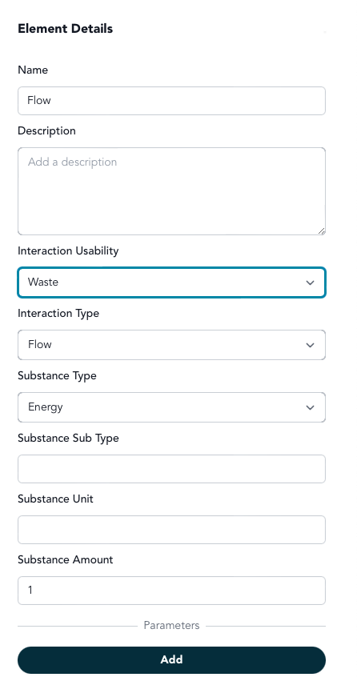

# Step 6: Add Waste Output

## What Does Your System Discard?

You've defined your system's primary output - the valuable thing it produces. But every real system also creates waste - byproducts that aren't useful to anyone in the environment or that may even be harmful.

Understanding waste helps you see the full picture of what your system does and identify potential improvement opportunities.

## Creating the Complete Waste Flow

Systems modeling requires connecting three elements: the flow, its interface, and its destination:

1. **Create the waste flow** - Click the green flow button and draw outward from your system
2. **Define the flow** - Click on the flow to specify what waste your system produces  
3. **Create the interface** - The flow will end in a rectangle (interface) where waste exits
4. **Add waste sink** - Create a sink in the environment to receive the waste

<figure><figcaption></figcaption></figure>

## Defining Your Waste Flow

When you click on the waste flow, specify:

**Substance Type** - What kind of waste? (Material, Energy, or Information)

**Usability** - Select "Waste" (something not useful to the environment)

**Examples from our model library:**
- **Cell**: "Carbon dioxide and metabolic toxins" (Material waste)
- **Ecosystem**: "Dead biomass and nutrient depletion" (Material waste)  
- **Solar Panel**: "Heat dissipation" (Energy waste)
- **Organization**: "Rejected proposals and bureaucratic overhead" (Information waste)
- **LLM**: "Computational heat and irrelevant generations" (Energy + Information waste)

<figure><figcaption></figcaption></figure>

## Why Waste Matters

Identifying waste reveals:
- **Inefficiencies**: Where your system could work better
- **Environmental impact**: What your system imposes on its surroundings  
- **Design opportunities**: How you might capture or reduce waste

No system is perfectly efficient. Acknowledging waste is the first step toward understanding your system's true environmental footprint and improvement potential.

