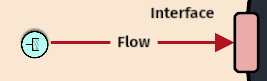
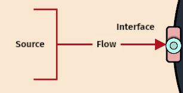

# Step 7: Identify Primary Inputs

## What Does Your System Need?

You've mapped your system's outputs and waste. Now you need to understand what your system requires to produce those outputs - what inputs does it need to take in, process, and transform?

Every system requires resources, energy, or information from its environment to function and create its outputs.

## Creating the Complete Input Flow

Just like with outputs, you need to connect three elements: the flow, its interface, and its source:

1. **Create the input flow** - Click the green flow button on the left side of your system  
2. **Define the flow** - Click on the flow to specify what your system needs
3. **Create the interface** - The flow starts with a rectangle (interface) where input enters
4. **Add input source** - Create a source in the environment that provides this input

<figure><figcaption></figcaption></figure>

## Defining Your Input Flow

When you click on the input flow, specify:

**Substance Type** - What kind of input? (Material, Energy, or Information)

**Usability** - Select "Resource" (something useful your system needs)

**Examples from our model library:**
- **Cell**: "Glucose and oxygen" (Material resources for metabolism)
- **Ecosystem**: "Sunlight and mineral nutrients" (Energy + Material resources)  
- **Solar Panel**: "Solar radiation" (Energy resource)
- **Organization**: "Raw materials and labor" (Material + Information resources)
- **LLM**: "User prompts and training data" (Information resources)

<figure><figcaption></figcaption></figure>

## Creating the Input Source

Your input needs to come from somewhere in the environment:

**Click the source button** and place it outside your system to represent what provides this input.

**Examples of input sources:**
- **Cell**: "Bloodstream" (delivers glucose and oxygen)
- **Ecosystem**: "Atmosphere and soil" (provides sunlight and nutrients)
- **Solar Panel**: "Sun" (source of solar energy)
- **Organization**: "Suppliers and labor market" (provide materials and workers)
- **LLM**: "Users and datasets" (provide prompts and training information)

<figure><figcaption></figcaption></figure>

## Why Input Analysis Matters

Understanding inputs helps you see:
- **Dependencies**: What your system relies on to function
- **Vulnerabilities**: What happens if inputs are interrupted
- **Requirements**: What quality and quantity your system needs

Every output requires corresponding inputs. If you can't identify what your system needs to produce its outputs, you may be missing critical dependencies or resources.
