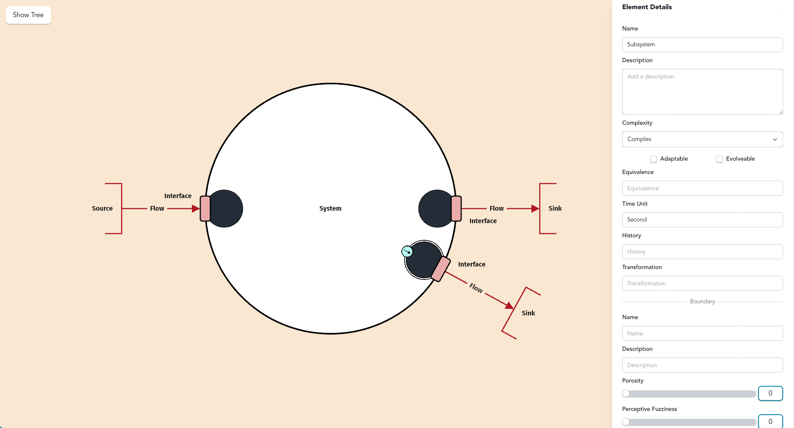

# Step 9: Add Boundary Subsystems

### Subsystems

As systems become complex, they can be broken down into **subsystems** - smaller, more manageable components that perform specific functions within the larger system.

**Characteristics of subsystems:**

* Encapsulate related functionality
* Can contain their own interfaces and internal elements
* Allow for hierarchical system decomposition
* Help manage complexity through abstraction

**Click the green circle on top of the interface.**&#x20;

<figure><figcaption></figcaption></figure>

The system will immediately turn white because we have transitioned from black box to white box analysis, looking at internals.&#x20;

<figure><figcaption></figcaption></figure>

Each subsystem is itsself, a system, to be treated as an SOI. You'll be presented with element detail tab identical to the one from one we started.&#x20;

Do the same for the other two interfaces.&#x20;

<figure><figcaption></figcaption></figure>

Now ready to start connecting our subsystems, identifying how they interact with each other.&#x20;
