# Why BERT?

## **Why BERT Exists** 

Modern systems are increasingly complex, interconnected, and difficult to understand through conventional analysis methods. Abstract modeling approaches often lose critical details and meanings that are essential for deep systems understanding.

BERT was created to address these challenges by implementing a rigorous methodology called Deep Systems Analysis (DSA). Through DSA, BERT helps you:

* Systematically decompose complex systems into manageable components
* Preserve critical flows, interfaces, and relationships between components
* Capture knowledge in a standardized, computable format
* Build hierarchical models with unlimited decomposition levels

Unlike traditional diagramming or modeling tools, BERT enforces methodological rigor based on systems science principles, helping you capture not just the components of a system, but the crucial flows, interfaces, and relationships that define its behavior. detailed understanding of complex systems while preserving the crucial details and relationships that are often lost through traditional modeling approaches.

## BERT is For

* **Systems Analysts** who need to understand and document complex systems
* **Researchers** studying system dynamics and relationships
* **Engineers** designing robust, resilient systems
* **Decision Makers** seeking to understand system impacts and dependencies
* **Educators** teaching systems thinking and analysis methods

Whether you're mapping organizational processes, analyzing technology ecosystems, or researching complex social systems, BERT provides the structured approach needed to develop genuine systems understanding.

## How BERT Works - Architecture Overview

BERT combines systems science theory with modern software architecture to provide real-time, interactive system modeling:

```mermaid
graph TD
    A["Systems Science Theory<br/>Mathematical Foundation"] --> B["Interactive Visual Interface<br/>Real-time System Modeling"]
    B --> C["Rigorous Analysis<br/>Deep Systems Understanding"]
    
    subgraph "Built with Modern Technology"
        D["🎨 Reactive Web Interface"]
        E["⚡ Real-time Rendering Engine"]
        F["💾 Cross-platform File System"]
    end
    
    B <--> D
    B <--> E
    B <--> F
    
    style A fill:#e1f5fe
    style B fill:#e8f5e8
    style C fill:#fff3e0
    style D fill:#f3e5f5
    style E fill:#fce4ec
    style F fill:#f1f8e9
```

**What makes BERT different:** Unlike traditional diagramming tools, BERT enforces methodological rigor while providing an intuitive, interactive experience that works seamlessly across web browsers and desktop applications.

💡 **Ready to get started?** Continue to [Creating Your First System](creating-your-first-system/) to begin building your first system model.
